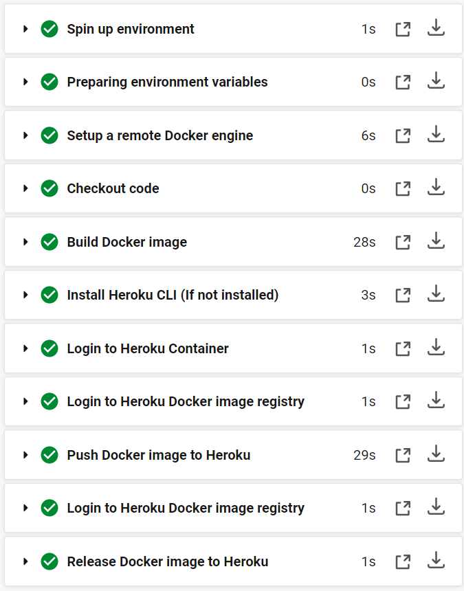
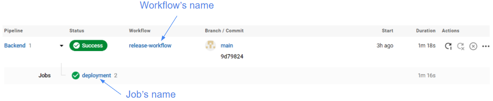

# Overview
CircleCI is a continuous integration and continuous delivery platform. Find out more about the usage of the `config.yml` in their [official guide](https://circleci.com/docs/2.0/config-intro/).

<br>

# Learnings
## [Version](https://circleci.com/docs/2.0/configuration-reference/#version)
```yml
version: 2.1
```
This declares the specific version of CircleCI pipeline process engine.

## [Orbs](https://circleci.com/docs/2.0/orb-intro/)
Sharable packages of parameterizable reusable configuration elements, including jobs, commands, etc.
```yml
orbs: 
  heroku: circleci/heroku@1.2.6
```
This declares the usage of the heroku orb, which will be used later in the config file. Find out more from its [official documentation](https://circleci.com/developer/orbs/orb/circleci/heroku).

## [Jobs](https://circleci.com/docs/2.0/configuration-reference/#jobs)
This section contains a list of job, identified by their unique job name. This is only a declaration of the job. The sequence of the jobs to be ran is determined in our workflow.
```yml
jobs: # Contains a list of jobs
  deploy: # Job name
    # Below are the configurations and steps to be used in this job
    docker: # The place where the steps are executed
      - image: cimg/base:2021.07 # Docker image to be used. Prefix cimg suggests that it is an image by CircleCI.
    steps: # Sequential list of tasks to be performed in this job
      - setup_remote_docker
      - checkout
      - run: 
          name: Build Docker image
          command: docker build .
      - heroku/install
      - run:
          name: Login to Heroku Container
          command: heroku container:login
      - heroku/push-docker-image: # From the heroku orb
          app-name: zenrailz-backend
          process-types: web
      - heroku/release-docker-image: # From the heroku orb
          app-name: zenrailz-backend
          process-types: web
```
### Lists of steps defined in the job


## [Workflows](https://circleci.com/docs/2.0/configuration-reference/#workflows)
```yml
workflows:
  release-workflow: # Workflow name
    jobs:           # List of job names to be executed
      - test        # job name
      - deploy:     # job name
          requires:
            - test  # deploy job to run after test job
```


<br>

# Resources
- [CircleCI](https://circleci.com/)
